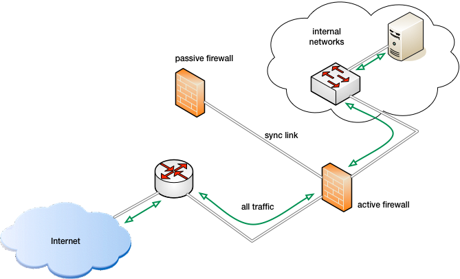
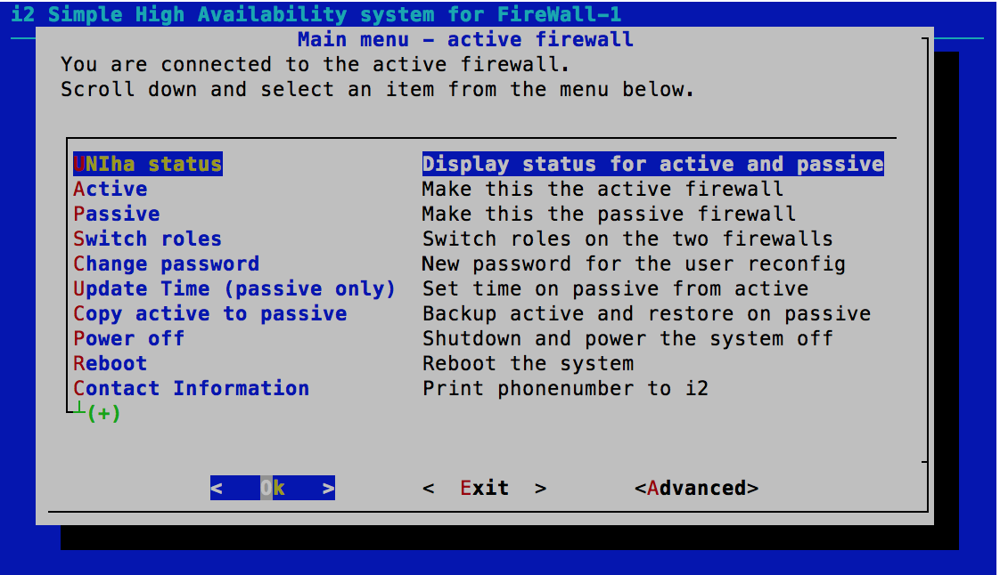

#Introduction

**UNIha** is a simple high availability solution for Check Point
firewall-1. This version is compatible with GAiA and has been tested on
R77.10, R77.20 and R77.30, and should work with all later R77.x versions.

The setup requires two identical hosts connected by a patch cable. One host is
configured as the active firewall while the other is configured as a passive
standby host (passive firewall).

There is only one active firewall at a time.  

The passive firewall checks the active for configuration changes. Switching
firewall is done by moving cables and operating the terminal user interface.

**UNIha** does not detect failures on the active firewall. It does not do load
share and does not change role based on link. The role (active or passive) is
persistent and survives reboot.
Check Point offers both high availability and load share solutions; compared to
**UNIha** they are costly and more complex to configure, but offers zero
downtime and no connection loss a node in the cluster fails.

**UNIha** is licensed as described in LICENCE (BSD license) but requires a
valid support contract with [Check Point Technologies](http://www.checkpoint.com).
**UNIha** is installed as an
[rpm package](http://en.wikipedia.org/wiki/RPM_Package_Manager).

#How does UNIha work

The _passive_ firewall checks if the firewall configuration on the _active
firewall_ has changed each quarter. If the [md5
fingerprint](http://en.wikipedia.org/wiki/Public_key_fingerprint) of the
_object database_ on the active firewall has changed, the passive firewall
executes a backup on the active, and restores it on the passive. The restore
process starts the firewall on the passive and may re-boot the passive as well.

If changes is made to the active firewall which does not change the object
database (e.g. changes to routing) no automatic update is done. In that case
you may force an update from the terminal user interface.

**UNIha** stops the firewall software on the passive and changes the IP address
of the link interface shared with the active firewall to match the configuration
of the passive.

The backup and restore is done with Check Point commands, and the backup
archive is transferred with [ssh](http://en.wikipedia.org/wiki/Secure_Shell).
The backup and restore does not disrupt the active firewall.

The backup _will fail_ if an
[CPMI](http://www.cisco.com/en/US/docs/ios-xml/ios/qos_nbar/prot_lib/configuration/xe-3s/proto_lib3.pdf)
connection is present (GUI running) on the active firewall. In that case the
passive waits until the CPMI session ends.

#What not to expect from **UNIha**

**UNIha** is focused on keeping the active and passive firewall in sync. It does
not detect errors or faults on the active firewall. It does not change
configuration on its own initiative. It requires manual intervention. The
design has focus on stability on the cost of functionality and uptime.

#Using **UNIha**

**Reconfiguration** is done using the user ``reconfig``, not the default administrator
account. The user login shell is a TUI (terminal user interface). The user has
administrative rights on the firewalls; the TUI is only for convenience. There
is no default password.

The TUI is a front end to ``/home/UNIha/bin/UNIha``
which may be called directly by an experienced administrator or a script.
A short help text is shown when it is called without any arguments.

##Available commands
The [_Terminal User Interface_](http://en.wikipedia.org/wiki/Text-based_user_interface)
enables reconfiguration, role change, shutdown etc. and changing password for
the user ``reconfig``.

Please notice that the _the password must be changed on both
the active and the passive firewall_.

##Changing password
The password for the user ``reconfig`` may be set by the administrator using
the command

        clish -sc "set user reconfig password"

or set using the TUI with the command

        su - reconfig

selecting _change password_ and following the on screen instructions.  
Remember to do so on both the __active__ and __passive__ firewall.

Some commands may take longer than other to execute. A list of commands
is shown here:

| Menu | Description | Warning | Time |
| ----- | ------------- | --------- | ----- |
| UNIha status | Display status for active and passive | no | short |
| Active | Make this the active firewall  | yes | long |
| Passive | Make this the passive firewall  | yes | short |
| Switch roles | Switch roles on the two firewalls  | yes | long |
| Change password | New password for the user reconfig  | no | short |
| Update Time (passive only) | Set time on passive from active  | no | short |
| Copy active to passive  | Backup active and restore on passive  | yes | Very long |
| Power off | Shutdown and power the system off  | yes | short |
| Reboot  | Reboot the system  | yes | long |
| Contact Information | Print phonenumber to UNI-C  | no | short |
| About UNIha | History | no | short |
| Run clish | Execute clish (See Check Point documentation) | no | n/a |
| Run /bin/bash | Execute login shell | no | n/a |

#Cables
Operations which changes the status of the two hosts may require changing
cables. Change the cables one at a time in any order before or after the
change.

#How to solve known problems
SSH is pesky; the start-up script generates keys if they are not present. If
the start-up scripts runs during restore, new keys will be created which will
lead to problems with the ssh client complaining about changed keys. A restore
will fix that.

Running ``clish`` or ``/bin/bash`` may be required to solve some problems but is
generally not encouraged.

Contact information:

| Contact      | Information      |
| ------------ | ---------------- |
| Name         | Contact name     |
| Direct phone | +45 12 34 56 78  |
| Main phone   | +45 12 34 56 78  |
| e-mail       | contact@email.tld|
| Address      | Address here     |
| EAN          | REAL EAN         |
| CVR          | REAL CVR         |

Writing down passwords is __insecure__ but convenient. If you do so, then keep it safe.

| Var             | value         |
| --------------- | ------------- |
| Login user name | ``reconfig``      |
| Password        | ............................................................. |

