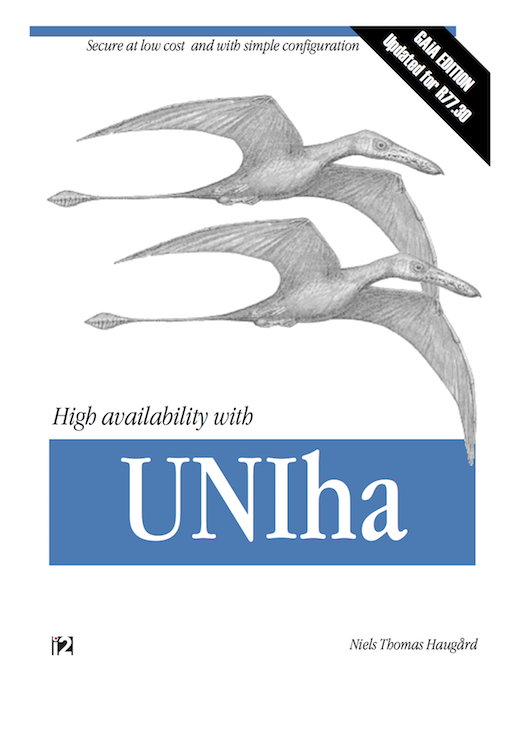

#Introduction

**UNIha** is a simple high availability solution for Check Point
firewall-1. This version is compatible with GAiA and has been tested on
R77.10, R77.20 and R77.30, and should work with all later R77.x versions.

The setup requires two identical hosts - an _active firewall_ and a _passive
firewall_ - connected with a patch cable and a terminal user interface for
configuration.  
There is only one active firewall at a time.  
The passive firewall pulls the active for configuration changes. Switching
firewall is done by moving cables and operating the terminal user interface.

UNIha does not detect failures on the active firewall. It does not do load
share and does not change role based on link. The role (active or passive) is
persistent and survives reboot.
Check Point offers both high availability and load share solutions; compared to
UNIha they are costly and complex to configure, but offers zero downtime and no
connection loss when data travels through the system.
The following requires knowledge on network, IP and some knowledge on UNIX.

**UNIha** is licensed as described in LICENCE (BSD license) but requires a
valid support contract with both [i2.dk](http://www.i2.dk) and [Check Point
Technologies](http://www.checkpoint.com).
**UNIha** is installed as an [rpm package](http://en.wikipedia.org/wiki/RPM_Package_Manager).

##How does UNIha work

The _passive_ firewall checks if the firewall configuration on the _active
firewall_ has changed each quarter. If the [md5
fingerprint](http://en.wikipedia.org/wiki/Public_key_fingerprint) of the
_object database_ on the active firewall has changed, the passive firewall
executes a backup on the active, and restores it on the passive, stops the
firewall software and changes the IP address of the link interface to that of
the passive firewall. The backup and restore is done with Check Point commands,
and the backup archive is transferred with [ssh](http://en.wikipedia.org/wiki/Secure_Shell).

The backup _will fail_ if an
[CPMI](http://www.cisco.com/en/US/docs/ios-xml/ios/qos_nbar/prot_lib/configuration/xe-3s/proto_lib3.pdf)
connection is present (GUI running) on the active firewall. In that case the
passive waits until the CPMI session ends.

##What not to expect from UNIha

UNIha is focused on keeping the active and passive firewall in sync. It does
not detect errors or faults on the active firewall. It does not change
configuration on its own initiative. It requires manual intervention. The
design has focus on stability on the cost of functionality and uptime.

##Installation and configuration UNIha

The installation is usually done by a consultant from UNI•C. The package
**UNItools** is a prerequisite of UNIha.

You will need the following information before the installation:

| Host    | Internet Interface  | Sync Interface  | IP addr on sync interface  | Netmask on sync interface |
| ------- | ------------------- | --------------- | -------------------------- | ------------------------- |
| active  |                     |                 |                            |                           |
| passive |                     |                 |                            |                           |

UNIha installs as a package

    rpm -Uvh UNIha-1.0-1.rpm

where //1.0// is the major version and //-1// the release. Your version may be newer, but
the installation procedure will be identical.

UNIha is removed with the command ``rpm -e UNIha-1.0-1``.

1. You will need **two identical hosts** with **identical configuration** (IP,
   hostname, firewall config etc). and a dedicated interface for sync'ing the
   firewall configuration. A dedicated interface is required to protect the
   services on the non-active firewall.
1. Install and finish the installation of an R77.30 firewall (firewall, licence
   etc) on the first host.
1. install the package **UNItools** and the package **UNIha**
1. Create a backup of the firewall (see **sk91400**).
1. Create a new firewall, but this time with the other IP address on the sync
   interface than the first firewall. Do a minimal installation with identical 
   software.
1. Copy the backup archive to the same place on the new firewall
1. Copy the ``rpm`` for UNItools and UNIha.
1. Restore the backup using the archive created previously. Copy the archive from the
   latest firewall as scp is not allowed (will be enabled by the installation of
   UNItools).
1. Reboot, move cables to the new firewall and install UNItools and copy UNIha.

After installation the configuration is done with the self explaining application:

    /home/UNIha/bin/makeconf 

UNIha requires its own private LAN usually connected with a crossed drop cable.
The network should be carefully chosen not to be used elsewhere on the network
topology.

##Using UNIha

Reconfiguration is done using the user reconfig, not the default administrator
account. The users login shell is a TUI (terminal user interface). The user has
administrative rights on the firewalls; the TUI is only for convenience. There
is no default password.

The TUI is a front end to ``/home/UNIha/bin/UNIha``
which may be called directly by an experienced administrator.

###Introducing the TUI

The password the user reconfig may be set the first time using the command

        su - reconfig

select change password and follow the on screen instructions. Do so on both
the __active__ and __passive__ firewall.

Some commands may take longer than other to execute:

| Menu | Description | Warning | Time |
| ----- | ------------- | --------- | ----- |
| UNIha status | Display status for active and passive | no | short |
| Active | Make this the active firewall  | yes | long |
| Passive | Make this the passive firewall  | yes | short |
| Switch roles | Switch roles on the two firewalls  | yes | long |
| Change password | New password for the user reconfig  | no | short |
| Update Time (passive only) | Set time on passive from active  | no | short |
| Copy active to passive  | Backup active and restore on passive  | yes | Very long |
| Power off | Shutdown and power the system off  | yes | short |
| Reboot  | Reboot the system  | yes | long |
| Contact Information | Print phonenumber to UNI-C  | no | short |
| About UNIha | History | no | short |
| Run sysconfig | Execute sysconfig (See Check Point documentation) | no | n/a |
| Run /bin/bash | Execute login shell | no | n/a |

##Cables
Operations which changes the status of the two hosts may require changing
cables. Change the cables one at a time in any order before or after the
change.

##How to solve known problems
SSH is pesky; the start-up script generates keys if they are not present. If
the start-up scripts runs during restore, new keys will be created which will
lead to problems with the ssh client complaining about changed keys. A restore
will fix that.

Running ``clish`` or ``/bin/bash`` may be required to solve some problems but is
generally not encouraged.

Writing down passwords is insecure.

| Login user name | reconfig      |
| --------------- | ------------- |
| Password        |               |

